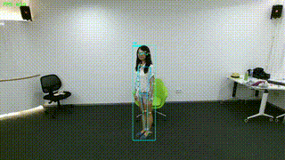

# anomaly-detection

这是一个基于jetpack6.2和conda的智能跌倒检测项目


## 如何使用跌倒检测项目？

### 1.克隆项目

```bash
git clone -b dev https://code.robot-gym.com/qijia/qijia-demo4-anomaly-detection.git
```

```bash
cd qijia-demo4-anomaly-detection
```

### 2.安装环境

#### 1.创建conda

```bash
conda create -n AnmDetect python=3.10
conda activate AnmDetect
```

```bash
cd envs
```

#### 2.pip安装相关库

```bash
pip install torch-2.8.0-cp310-cp310-linux_aarch64.whl torchvision-0.23.0-cp310-cp310-linux_aarch64.whl
pip install -r requirements.txt
```

#### 3.配置torch依赖

```bash
sudo dpkg -i cuda-keyring_1.1-1_all.deb
sudo apt-get update
sudo apt-get -y install cusparselt-cuda-12
```

### 3.关联相关库

#### 1.复制tensorrt库（关联也可以）

```bash
cp -r /usr/lib/python3.10/dist-packages/tensorrt* $CONDA_PREFIX/lib/python3.10/site-packages/
```

#### 2.配置CUDA环境

将以下内容添加到~/.bashrc中，重启终端或者source重新加载以生效

```bash
PATH=/usr/local/cuda/bin:$PATH
LD_LIBRARY_PATH=$LD_LIBRARY_PATH:/usr/lib/aarch64-linux-gnu/libcudss/12
CUDA_HOME=/usr/local/cuda
LD_PRELOAD=/usr/lib/aarch64-linux-gnu/libstdc++.so.6
```

### 4.为设备导出engine/onnx

```bash
cd scripts
python export_yolo2trt.py
python export_stgcn2trt.py
```

### 5.配置config.yaml文件

```yaml
# 跌倒检测系统配置文件
# 在PyCharm中直接修改此文件即可，无需命令行参数

# ========== 模型 ==========
models:
  # 单模型：YOLOv8-Pose，同时输出人框+COCO 17点关键点
  yolo_pose: "./checkpoints/yolov8n-pose.engine"
  stgcn: "./checkpoints/stgcn.engine"

# ========== 输入/输出 ==========
input:
  source: "/dev/video6"  # 摄像头ID (如 "0", "1") 或视频/图片路径（Windows路径使用正斜杠或双反斜杠）
              # 示例: "0" 或 "1" (摄像头), "F:/path/to/video.avi" (视频), "F:/path/to/image.jpg" (图片)
  mode: "auto"  # "auto" 自动识别, "video" 视频模式, "image" 图片模式, "camera" 摄像头模式
  rotate: 0  # 旋转角度: 0, 90, 180, 270

output:
  show_result: false  # 是否显示结果窗口（图片模式）
  window_name: "Fall Detection"  # 显示窗口名称

# ========== 类别映射配置 ==========
# STGCN输出的类别含义（class 0和1分别代表什么）
class_mapping:
  "0": "Fall"  # class 0 表示跌倒
  "1": "Normal"  # class 1 表示正常

# ========== 检测 ==========
detection:
  box_conf_threshold: 0.75  # YOLO检测置信度阈值
  pose_conf_threshold: 0.55  # 关键点置信度阈值
  min_box_size: 10  # 最小检测框尺寸（宽或高小于此值将被忽略）
  max_persons: 1  # 每帧最多处理多少人（按置信度排序），默认1人

# ========== 时序/推理 ==========
processing:
  pose_interval: 1  # 每N帧进行一次姿态估计（1表示每帧都检测）
  window_size: 50  # STGCN窗口大小（帧数）
  prediction_interval: 1  # 每N帧进行一次跌倒预测
  buffer_multiplier: 2  # 缓冲区大小倍数（window_size * multiplier）
  min_frames_for_prediction: 30  # 最小预测帧数（小于此值不预测，0表示允许任何帧数预测）
  use_sliding_window: true  # 是否使用滑动窗口（true=只使用最新N帧，false=使用全部缓冲区）
  fall_confirm_frames: 15  # 二次确认：连续多少帧预测为跌倒才判定为跌倒（>=1）
  fall_prob_threshold: 0.65  # 跌倒类别概率的最低阈值（0-1），低于此值不计入连续跌倒帧

# ========== 设备 ==========
device:
  use_cuda: true  # 单开关：true=全链路尽量用 GPU，false=全链路 CPU
  # 上线版仅支持 STGCN TensorRT .engine；此项不再需要

# ========== 运行时 ==========
runtime:
  verbose: false  # true 时输出更多调试信息

```

### 6.运行推理

```bash
python RobGymInfer.py
```

## 视频演示



<video src="./test_20260129_110150.mp4"></video

